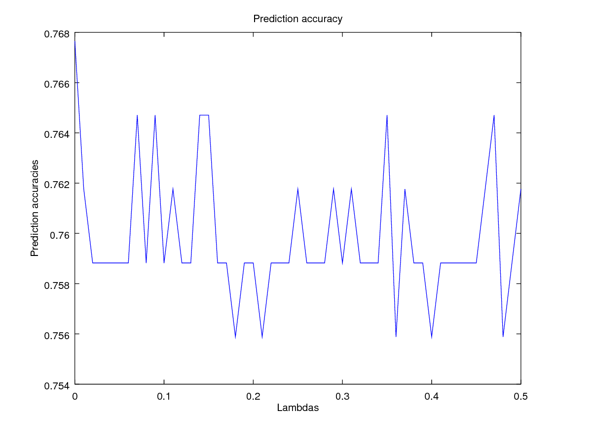
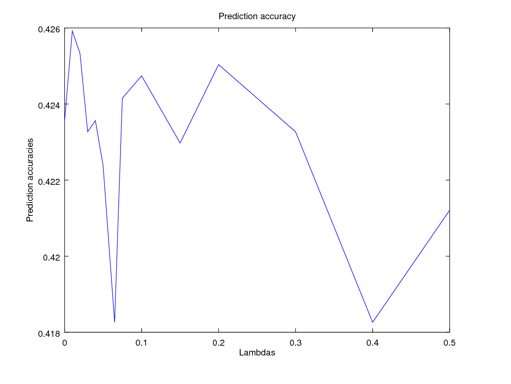
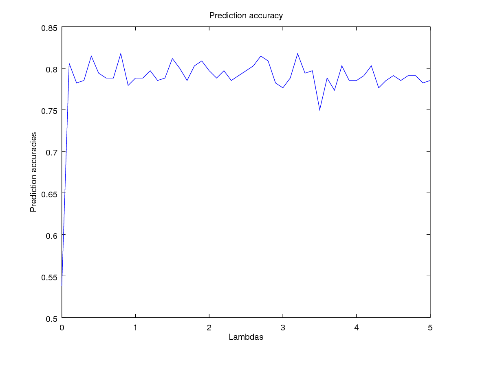

% Starcraft II League Prediction
% Borja Lorente Escobar
% February 2017

Domain and Motivation
========
Starcraft II is a Real Time Strategy game, launched in 2010 by Blizzard. Since then, it has become one of the most popular competitive games of it's time, kickstarting the ascent of the E-sports into the mainstream.

As it is common in gaming, the community has gathered a collective knowledge of the characteristics of a good player. Some of these features are measurable, and players seeking to improve are often met with the advice that they analyze their scores in these aspects, and try to improve them. The most prominent measures of players skill are commonly:

* **Actions Per Minute** or **APM**, the number of mouse clicks, moves or key presses a player performs. The best players have an APM of around 400, while an average player will rarely go over 120.
* **Workers Created**. In Starcraft II, the player with the most resources usually wins the game, and thus it is deemed important for a good player to constantly be creating workers to gather as many resources as possible.
* **Minimap Clicks**. Since a Starcraft II player has to control every single unit in the team, many places often require immediate attention, such as jumping from a battle on one side of the map to creating new workers back at the base. This is why efficient camera movement is vital for a player, and therefore a good player will often click on the minimap to move the camera, instead of dragging it to the sides, as it is much faster.

The aim of this study is to determine how useful these player traits are when trying to predict the skill level of a player. In the case that they're not very significant, a secondary goal is to determine _which_ attributes are truly determinant of a player's skill.

To that end, the analyzed data has been extracted from game replays of real users of every ranking.

Dataset Details
-------------
The extracted data(1) comes in the form of a `.csv` file containing data from over 3300 games, one data point per line, organized by columns denoting the various values of the studied attributes:

|       |         |           |
|------------------|--------------------|-----------------|
| GameID           | **LeagueIndex**        | Age             |
| HoursPerWeek     | TotalHours         | **APM**           |
| SelectByHotkeys  | AssignToHotkeys    | UniqueHotkeys   |
| MinimapAttacks   | **MinimapRightClicks** | NumberOfPACs    |
| GapBetweenPACs   | ActionLatency      | ActionsInPAC    |
| TotalMapExplored | **WorkersMade**        | UniqueUnitsMade |
| ComplexUnitsMade | ComplexAbilityUsed | MaxTimeStamp    |

The **LeagueIndex** attribute denotes the rank of the player, from Bronze to Diamod, with a higher number indicating a higher rating.

To preprocess the data, `Octave`'s built-in `.csv` manipulation tools were used, by loading the file and stripping the header:

```octave
raw_data = dlmread('rawdata/starcraft.csv', ',');
% Ignore the first row (names)
raw_data = raw_data(2:rows(raw_data), :);
% Select base attributes
[X, y] = selectBaseAttributes(raw_data);
% Split samples into training, validation and test sets
[X_train, y_train, X_val, y_val, X_test, y_test] = splitSamples(X, y);
```

This structure gives the necessary flexibility to study the effects of different attribute selections (by modifying `selectBaseAttributes`), and to create arbitrary sets of samples for test and validation.

After some adjustments, the following split was fould the most satisfying for the distribution of samples, which were obtained by a random shuffling of the samples with the following code:

| Training | Validation | Test |
|----------|------------|------|
| 80%      | 10%        | 10%  |

\pagebreak

```octave
function [X_train, y_train, X_val, y_val, X_test, y_test] = splitSamples(X, y)
	m = rows(X);

	train_percent = 0.8;
	val_percent = 0.1;
	test_percent = 0.1;
	train_size = floor(train_percent * m);
	val_size = floor(val_percent * m);
	test_size = floor(test_percent * m);

	index_vector = randperm(m);
	index = 1;
	train_indices = index_vector(index:(index + train_size));
	index += train_size;
	val_indices = index_vector(index:(index + val_size));
	index += val_size;
	test_indices = index_vector(index:(index + test_size));

	X_train = X(train_indices, :);
	y_train = y(train_indices, :);
	X_val = X(val_indices, :);
	y_val = y(val_indices, :);
	X_test = X(test_indices, :);
	y_test = y(test_indices, :);
end  % splitSamples
```

\pagebreak

Methodology
============

As this was an exploratory study, there were several iterations over the classification techniques used.

However, some things became apparent from the beginning, such as the inability of **Support Vector Machines** to correctly predict the league of a player, **never reaching an accuracy of 10% over the set samples**. Therefore, even though the used hyper-parameters will be explained in the following section and the source code can be found in the annex, the results have been omitted from the discussion of the different iterations. The focus of the results is therefore on the **Logistic Regression** and **Neural Networks**.


Hyper-parameters Adjustment
---------------------------

Where two or more hyper-parameters where listed the program iterated over all the possible combinations of the sets.

### Logistic Regression
```octave
λ = 0:0.01:0.5;
```

Using `fminunc` with a max of 5000 iterations.

### Neural Networks
```octave
λ = 0:0.1:5;
hidden_layer_sizes = [5, 10, 25, 50, 100, 150];
```

Using `fmingc` with up to 5000 iterations were allowed. With hidden layer sizes above 25, all iterations were used up by the function. In addition to that, higher layer sizes seem to predict better with higher `λ`s.

In the result graphs, only the best graph is shown out of all the hidden layer sizes.

### Support Vector Machines
```octave
CSigma_seeds = 0.01:0.01:0.04;
CSigma_iterations = 5;
```
Here the C and sigma values were created by iterating over the `CSigma_seeds` vector in the following manner:

```octave
function [pool] = generateValuePool(seeds, iterations)
	pool = zeros(columns(seeds), iterations);
	for i = 0:iterations
		pool(:, i + 1) = seeds .* (10 ^ i);
	endfor
	% Vectorize pool
	poolsize = numel(pool);
	pool = reshape(pool, 1, poolsize);
endfunction

```

Iterations
-------------

Three sets of attributes were tested:
* The original set of **APM**, **WorkersMade** and **MinimapRightClicks**.
* All of the attributes.
* A hand-picked set of attributes from a previous researcher(2). The selected attributes were the ones that scored highest. The column references are `[5, 6, 7, 12, 13, 14]`.

Over these sets of attributes, two different approaches were used:

* To try to predict a player's exact **LeagueIndex**, from 1 to 7.
* To transform the problem into a binary decision problem, by classifying the examples into _High Rating_ (**LeagueIndex** above 4, Diamond or above) and _Low Rating_ (Platinum or below).

\pagebreak

Results
=======

Percentages
-----------
This tables reflect the best results achieved for both problems, in the given datasets. In bold the best percentages of accuracy over the test samples of each category.

### With APM, WorkersMade and MinimapRightClicks

| Method       | Precise prediction | Binary decision |
|---------------|:-------------------:|:------------------:|
| LR            |        21.01%       |      40.94%    |
| NN            |      29.02%     |        50.74%      |

### With all attributes

| Method       | Precise prediction | Binary decision |
|---------------|:-------------------:|:------------------:|
| LR            |        38.15%       |      75.18%  |
| NN            |      **42.26%**     |        **83.65%**    |

### With the hand-picked attribute set

| Method       | Precise prediction | Binary decision |
|---------------|:-------------------:|:------------------:|
| LR            |        34.48%       |      76.84%  |
| NN            |      36.54%     |        80.78%    |

Graphics
-----------

Following are the graphs showing the accuracy of the best executions, with information about the used parameters.







\pagebreak

Conclusions
===========
It immediately became obvious that _just_ **APM**, **WorkersMade** and **MinimapRightClicks** were _not sufficient_ to determine a player's skill level. However, it is noteworthy that **APM** has a high score in the hand-picked set of attributes, which were very close to the best prediction. Therefore, we can assume that **APM** is in fact a relevant factor for a player's rank.

Possible Improvements
=====================

SVM libraries
---------------------
The poor results of the Support Vector Machines may be due to an undetected implementation error, which may be solved by using tried-and-true third-party libraries such as `libsvm`(3).

Decision Trees
--------------
Another researcher got similar results with decision trees for the binary decision problem, but because we set out to not use any library we didn't have any implementation of decision trees available.

References
==========

(1): [https://www.kaggle.com/sfu-summit/starcraft-ii-replay-analysis](https://www.kaggle.com/sfu-summit/starcraft-ii-replay-analysis)

(2): [https://goo.gl/zXpwFP](https://www.kaggle.com/jonathanbouchet/d/sfu-summit/starcraft-ii-replay-analysis/leagueindex-prediction)

(3): [https://github.com/cjlin1/libsvm](https://github.com/cjlin1/libsvm)

Original source for the project and this paper: [https://github.com/blorente/Starcraft-II-Replay-Analysis](https://github.com/blorente/Starcraft-II-Replay-Analysis)

Pandoc compilation script and template by Álvaro Bermejo: [https://github.com/AlvarBer](https://github.com/AlvarBer)
